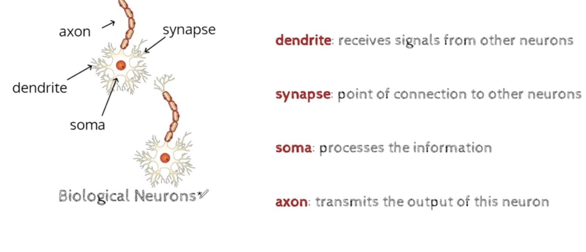
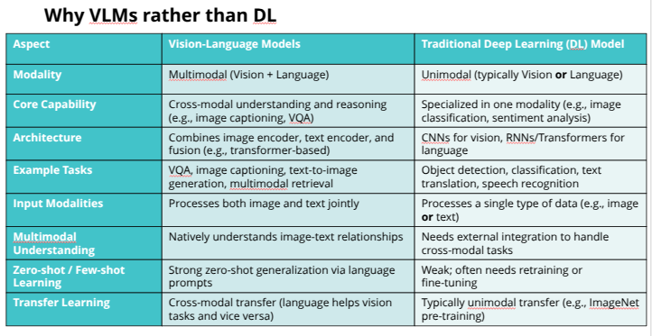
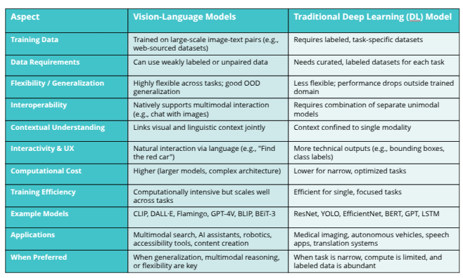
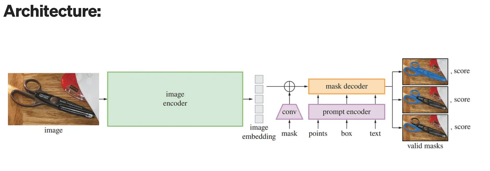
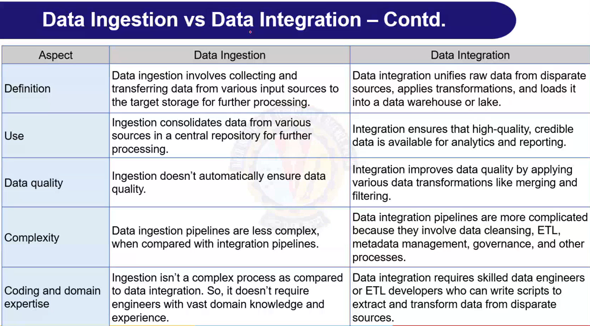
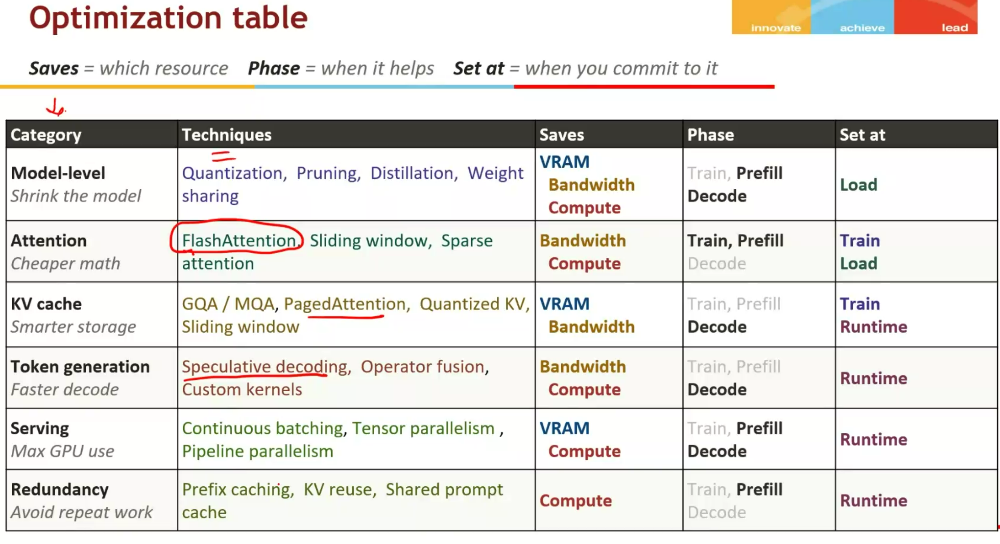

# Pytorch functions 

### 1) Tensor Creation
```
import torch

// From Python list

x = torch.tensor([1, 2, 3])
print(x)  // tensor([1, 2, 3])

// Uninitialized tensor (random values in memory)

x = torch.empty(2, 3)
print(x.shape)  // torch.Size([2, 3])

// Zeros

x = torch.zeros(2, 3)
print(x)  // tensor([[0., 0., 0.],
          //         [0., 0., 0.]])

// Ones

x = torch.ones(2, 3)
print(x)  // tensor([[1., 1., 1.],
          //         [1., 1., 1.]])

// Range

x = torch.arange(0, 10, 2)
print(x)  // tensor([0, 2, 4, 6, 8])

// Linspace

x = torch.linspace(0, 1, steps=5)
print(x)  // tensor([0.0000, 0.2500, 0.5000, 0.7500, 1.0000])

// Identity matrix

x = torch.eye(3)
print(x)
// tensor([[1., 0., 0.],
//         [0., 1., 0.],
//         [0., 0., 1.]])

// Random

x = torch.rand(2, 2)    # Uniform [0,1)
x = torch.randn(2, 2)   # Normal distribution (mean=0, std=1)
```
### 2. Tensor operations
```
x = torch.tensor([[1, 2, 3],
                  [4, 5, 6]])

// Reshape

y = x.reshape(3, 2)
print(y)
// tensor([[1, 2],
//         [3, 4],
//         [5, 6]])

// View (like reshape, but may share memory)

y = x.view(3, 2)

// Squeeze (remove dim=1)

x = torch.tensor([[1], [2], [3]])
print(x.shape)        

// torch.Size([3, 1])

y = x.squeeze()
print(y.shape)        
// torch.Size([3])

// Unsqueeze (add dimension)

y = x.unsqueeze(0)
print(y.shape)         
// torch.Size([1, 3, 1])

// Flatten

x = torch.tensor([[1, 2], [3, 4]])
y = x.flatten()
print(y)              
// tensor([1, 2, 3, 4])

// Concatenate

a = torch.tensor([1, 2])
b = torch.tensor([3, 4])
c = torch.cat([a, b])
print(c)              // tensor([1, 2, 3, 4])

// Stack (adds new dimension)

d = torch.stack([a, b])
print(d)              // tensor([[1, 2],
                     //         [3, 4]])
```

### 3) Mathematical Operations 
```
a = torch.tensor([1., 2., 3.])
b = torch.tensor([4., 5., 6.])

// Element-wise

print(torch.add(a, b))  

// tensor([5., 7., 9.])

print(torch.mul(a, b))  

// tensor([ 4., 10., 18.])

// Reduction

x = torch.tensor([[1., 2.], [3., 4.]])
print(x.sum())   // tensor(10.)
print(x.mean())  // tensor(2.5)
print(x.max())   // tensor(4.)
print(x.argmax())// tensor(3) (flattened index)

// Linear Algebra

A = torch.tensor([[1., 2.], [3., 4.]])

B = torch.tensor([[5., 6.], [7., 8.]])

print(torch.matmul(A, B))

// tensor([[19., 22.],
//         [43., 50.]])
```

### 4) Device management/Gpu
```
x = torch.tensor([1, 2, 3])

// Check GPU

print(torch.cuda.is_available())

// Move tensor to GPU

if torch.cuda.is_available():
    x = x.to("cuda")
    print(x.device)   # cuda:0
```

### 5) Autograd
```
x = torch.tensor([2.0], requires_grad=True)
y = x**2 + 3*x
y.backward()        // dy/dx = 2x + 3
print(x.grad)       // tensor([7.])

// No gradient tracking
with torch.no_grad():
    z = x * 2
print(z.requires_grad)  // False
```


### 6) Neural network
```
import torch.nn as nn

// Linear layer

layer = nn.Linear(4, 2)
x = torch.rand(1, 4)
print(layer(x))   # Output shape: (1, 2)

// Activation

act = nn.ReLU()
print(act(torch.tensor([-1., 0., 2.])))  # tensor([0., 0., 2.])

// Loss

loss_fn = nn.MSELoss()
y_pred = torch.tensor([0.5, 0.7])
y_true = torch.tensor([1.0, 0.0])
print(loss_fn(y_pred, y_true))  # tensor(0.3700)
```

### 7) Optimization 
```
model = nn.Linear(2, 1)
optimizer = torch.optim.SGD(model.parameters(), lr=0.01)

// Dummy data

x = torch.tensor([[1., 2.]])
y = torch.tensor([[1.]])

// Training step

pred = model(x)
loss = nn.MSELoss()(pred, y)
optimizer.zero_grad()
loss.backward()
optimizer.step()
```

### 8) Data loading 
```
from torch.utils.data import Dataset, DataLoader, TensorDataset

// Custom Dataset

class MyDataset(Dataset):
    def __init__(self, data, labels):
        self.data = data
        self.labels = labels
    def __len__(self):
        return len(self.data)
    def __getitem__(self, idx):
        return self.data[idx], self.labels[idx]

data = torch.tensor([[1], [2], [3]])
labels = torch.tensor([0, 1, 0])

dataset = MyDataset(data, labels)
loader = DataLoader(dataset, batch_size=2, shuffle=True)

for batch in loader:
    print(batch)
```

### 9) Serialization 
```
// Save model

torch.save(model.state_dict(), "model.pth")

// Load model

model = nn.Linear(2, 1)
model.load_state_dict(torch.load("model.pth"))
```
### 10) Random 
```
torch.manual_seed(42)
print(torch.rand(2, 2))   # Reproducible random values

print(torch.randperm(5))  # Random permutation
print(torch.randint(0, 10, (3,)))  # Random integers
```

### 11) Utilities 
```
x = torch.tensor([[1, 2, 3], [4, 5, 6]])

print(x.numel())    # 6 (number of elements)
print(x.size())     # torch.Size([2, 3])
print(x.shape)      # (2, 3)
print(x.clone())    # Copy of tensor
print(torch.equal(x, x.clone()))  # True
```
### 12) Pytorch dataset and data loader
```
🔹 Dataset

- Represents the entire data (images, text, numbers, etc.).

- Defines how to access one sample from the dataset.

- Implements __getitem__(index) → returns one data sample.

- Implements __len__() → returns total number of samples.

- Can be predefined (e.g., torchvision datasets) or custom (subclass Dataset).

- Example: A dataset of 10,000 images where each call gives one image + label.


🔹 DataLoader

- Works as a wrapper around Dataset.

- Provides an iterator over the dataset.

- Loads data in batches instead of one sample.

- Handles shuffling of data.

- Supports parallel loading using num_workers.

- Speeds up training by efficiently preparing batches.

- Example: Instead of fetching 1 image, DataLoader fetches a batch of 64 images at once.


from torch.utils.data import Dataset, DataLoader
import torch

// Step 1: Create dataset
class MyDataset(Dataset):
    def __init__(self):
        self.data = torch.arange(10)  # numbers 0-9

    def __len__(self):
        return len(self.data)  # total samples

    def __getitem__(self, idx):
        return self.data[idx]  # single sample

dataset = MyDataset()

// Step 2: Use DataLoader
loader = DataLoader(dataset, batch_size=3, shuffle=True)

// Step 3: Iterate batches
for batch in loader:
    print(batch)  # prints 3 numbers per batch
```

### 13) Components of PyTorch
```
- Tensors (torch.Tensor) → The basic data structure in PyTorch, similar to NumPy arrays, but with extra features like GPU acceleration.

- Autograd → PyTorch’s automatic differentiation engine that computes gradients for tensors, which is the key for training neural networks.

- Neural Network Module (torch.nn) → A high-level module that provides layers, loss functions, and tools to easily build neural network models.

- Optimizers (torch.optim) → Algorithms like SGD and Adam that update model parameters using the gradients calculated by autograd.

- Data Utilities (torch.utils.data) → Classes like Dataset and DataLoader to handle data loading, batching, and preprocessing efficiently.

- Ecosystem Libraries → Extensions such as TorchVision (for images), TorchText (for language), and TorchAudio (for audio tasks).

- CUDA Support (torch.cuda) → Lets you easily move tensors and models to GPU for faster training and computation.
```

### 14) Role of Loss Functions in PyTorch
```
- A loss function (also called a cost function or objective function) is a mathematical function that measures how well the model’s predictions match the target values.
          
- Roles in PyTorch training loop:

          - Measure error → Quantifies the difference between predicted outputs (y_pred) and true labels (y_true).
  
          - Guide optimization → Provides a signal for backpropagation (loss.backward()) so gradients can be calculated.
  
          - Control learning behavior → Different tasks need different losses (classification, regression, segmentation, etc.).
  
          - Impact convergence → The choice of loss affects how fast and how well the model learns.

- Differnt loss functions
  
          - Regression Losses
  
                      - Mean Squared Error Loss
  
                      - Mean Absolute Error Loss
  
          - Classification Losses
  
                      - Cross Entropy Loss
  
                      - Binary Cross Entropy Loss
  
                      - Negative Log Likelihood Loss
  
          - Ranking & Margin Losses
  
                      - Hinge Embedding Loss (nn.HingeEmbeddingLoss)
  
                      - Margin Ranking Loss (nn.MarginRankingLoss)
  
                      - Triplet Margin Loss (nn.TripletMarginLoss) (e.g., face verification, Siamese networks).
  
          - Specialized Losses
  
                      - Huber Loss
  
                      - KL Divergence Loss
  
                      - CTCLoss
  
                      - Dice Loss (custom, not built-in)
```
### 15) Common Learning Rate Schedules in PyTorch

	a. StepLR

	b. MultiStepLR

	c. ExponentialLR

	d. CosineAnnealingLR

	e. ReduceLROnPlateau

	d. CyclicLR

### 16) what are the different tensor datatypes available in pyTorch?
| **Data Type**                    | **Description**                                    | **Memory Size** | **Default Usage**              | **Example**                                      |
| -------------------------------- | -------------------------------------------------- | --------------- | ------------------------------ | ------------------------------------------------ |
| `torch.float32` / `torch.float`  | 32-bit floating point                              | 4 bytes         | Default for most deep learning | `torch.tensor([1.0, 2.0], dtype=torch.float32)`  |
| `torch.float64` / `torch.double` | 64-bit floating point                              | 8 bytes         | High-precision calculations    | `torch.tensor([1.0, 2.0], dtype=torch.float64)`  |
| `torch.float16` / `torch.half`   | 16-bit floating point (faster GPU training)        | 2 bytes         | Mixed precision training       | `torch.tensor([1.0, 2.0], dtype=torch.float16)`  |
| `torch.bfloat16`                 | 16-bit “brain float” (TPUs/GPU)                    | 2 bytes         | Mixed precision training       | `torch.tensor([1.0, 2.0], dtype=torch.bfloat16)` |
| `torch.int8`                     | 8-bit signed integer                               | 1 byte          | Small integer storage          | `torch.tensor([1, -2], dtype=torch.int8)`        |
| `torch.uint8`                    | 8-bit unsigned integer                             | 1 byte          | Image data / masks             | `torch.tensor([0, 255], dtype=torch.uint8)`      |
| `torch.int16` / `torch.short`    | 16-bit signed integer                              | 2 bytes         | Small integer storage          | `torch.tensor([1000, 2000], dtype=torch.int16)`  |
| `torch.int32` / `torch.int`      | 32-bit signed integer                              | 4 bytes         | General integer storage        | `torch.tensor([1000, 2000], dtype=torch.int32)`  |
| `torch.int64` / `torch.long`     | 64-bit signed integer                              | 8 bytes         | Default for indices            | `torch.tensor([1000, 2000], dtype=torch.int64)`  |
| `torch.bool`                     | Boolean tensor (True/False)                        | 1 byte          | Masks, conditions              | `torch.tensor([True, False], dtype=torch.bool)`  |
| `torch.complex64`                | 64-bit complex number (32-bit real + 32-bit imag)  | 8 bytes         | Scientific computing           | `torch.tensor([1+2j], dtype=torch.complex64)`    |
| `torch.complex128`               | 128-bit complex number (64-bit real + 64-bit imag) | 16 bytes        | High-precision complex numbers | `torch.tensor([1+2j], dtype=torch.complex128)`   |


Some save memory, some provide precesion, some enable GPU Acceleration.

### 17) What is the difference between torch.Tensor and torch.tensor()?

	1) torch.Tensor is the class constructor(like a factory), while tensor.tesor() is a function(like a smart assistance) that infers data types automatically.

	2) torch.Tensor([1,2,3]).dtype // torch.float32

	3) torch.tensor([1, 2, 3]).dtype  //  torch.int64

### 18) How can you convert a Numpy array to a Pytorch tensor and vice versa?

	a) Numpy to torch tensor
	```
		import numpy as np
		numpy_array = np.array([1,2,3,4])
		tensor = torch.from_numpy(numpy_array)
		tensor2 = torch.tensor(numpy_array)
	
	```
	b) torch to numpy
	```
		torch_tensor = torch.tensor([5,6,7,8])
		numpy_back = torch_tensor.numpy()
	```

	c) Combination numpy to tensor and tensor to numpy

	```
		numpy_array = np.array([1,2,3,4])
		torch_tensor = torch.from_numpy(numpy_array)
		numpy_back = torch_tensor.numpy()
	```

### 19) What is a gradient desecnt in pytorch?

	Gradient Descent is an optimization algorithm used to minimize a loss function in machine learning and deep learning.

	A loss function measures how far your model’s predictions are from the true values.

	Gradient descent updates the model’s parameters in the direction that reduces the loss.

### 20) How do you create a tensor in Pytoch

	Pytorch offers multiple ways to forge your data into powerful tensor form, each method serving different purpose.

	data = [[1,2],[3,4]]
	torch.tensor(data)
	torch.zeros(2,3)
	torch.ones(3,2)
	torch.randn(4)
	torch.randn(2, 3)
	torch.randint(3, 5, (3,))  // tensor([4, 3, 4])
	torch.randint(10, (2, 2))  // tensor([[0, 2], [5, 5]])
	torch.randint(3, 10, (2, 2)) // tensor([[4, 5], [6, 7]])

	torch.arange(5) // tensor([ 0,  1,  2,  3,  4])
	torch.arange(1, 4) // tensor([ 1,  2,  3])
	torch.arange(1, 2.5, 0.5) // tensor([ 1.0000,  1.5000,  2.0000])

	input = torch.empty(2, 3)
	torch.zeros_like(input)

	torch.zeros_like(torch.tensor(9)) // 0 is the output.

### 21) torch shape
```
import torch

// Create a 1D tensor

x = torch.tensor([1, 2, 3, 4, 5, 6])

print("Original tensor x:", x)
print("Shape of x:", x.shape)

// Reshape to a 2x3 matrix

y = torch.reshape(x, (2, 3))
print("\nReshaped tensor y (2x3):", y)
print("Shape of y:", y.shape)

// Reshape using the -1 wildcard

z = x.reshape((3, -1)) # Let PyTorch infer the second dimension
print("\nReshaped tensor z (3x-1):", z)
print("Shape of z:", z.shape)

// Flatten a 2D tensor

matrix = torch.tensor([[1, 2], [3, 4]])

flat_matrix = matrix.reshape(-1) # Flatten to 1D

print("\nOriginal matrix:", matrix)
print("Flattened matrix:", flat_matrix)
print("Shape of flattened matrix:", flat_matrix.shape)
```

### 22) What is pythorch and how does it differ from the tensorflow
	
	- PyTorch: A Python-based deep learning framework that uses dynamic computation graphs, making it easy and flexible for research and experimentation.

	- TensorFlow: A deep learning framework by Google that originally used static computation graphs, now supports dynamic graphs (eager execution). It’s widely used in production and deployment.
	- pytorch example
	```
		import torch
		x = torch.tensor([2.0], requires_grad=True)
		z = x**3 + 1
		z.backward()
		print("Value of z:", z.item())        
		print("Gradient dz/dx:", x.grad.item())
	```
	- Tensorflow example 

	```
		import tensorflow as tf  
		x = tf.Variable([2.0])
		with tf.GradientTape() as tape:
		    z = x**2 + 1
		dz_dx = tape.gradient(z, x)
		print("Value of z:", z.numpy())        
		print("Gradient dz/dx:", dz_dx.numpy())
	```

### 23) Explain the role of torch.Tensor

	It's a multi-dimensional array that can store numbers, perform mathematical operations, and automatically calculate gradients for macine learning.

	0D tensor → scalar (x = torch.tensor(5))
	1D tensor → vector (x = torch.tensor([1,2,3]))
	2D tensor → matrix (x = torch.tensor([[1,2],[3,4]]))

	x = torch.tensor([1, 2, 3])
	y = x * 2  # element-wise multiply → [2, 4, 6]

### 24) How to handle dimensional error in pytorch 
```
Check shapes → Always print(tensor.shape) before operations.

Broadcasting → Works if sizes match except for 1, else reshape.

Reshape correctly → Use .view(), .reshape(), .unsqueeze(), .squeeze().

Matrix multiplication → Inner dimensions must match (m, n) @ (n, p).

Concatenation → All tensors must match in every dimension except the one you concat on.

Padding / trimming → Use torch.nn.functional.pad() to equalize sizes.

Batch dimension → Models expect (batch, channels, H, W) → add with .unsqueeze(0).
```

### 25) Benefits of transfer learning
```
The main benefits of transfer learning in AI are reduced training time and data requirements, leading to lower computational costs and higher accuracy. By leveraging knowledge from pre-trained models, developers can achieve better performance with less task-specific data, making AI development more efficient and accessible.  

Here's a breakdown of the benefits:

	Reduced Training Time: Instead of training a model from scratch, transfer learning uses pre-trained models, which have already learned general features from large datasets. This allows the new model to learn the target task much faster. 
	
	Less Data Required: Training deep learning models from scratch requires vast amounts of data, which can be expensive and difficult to obtain. Transfer learning enables high-quality results with smaller datasets, making it valuable for tasks where data is limited, such as in specialized domains.
	
	Improved Performance & Accuracy: Models often perform better on the new task because they start with a foundation of learned features and patterns from a related problem. This pre-learned knowledge helps the model generalize more effectively.
	
	Lower Computational Costs: By reducing the need for extensive training and data, transfer learning significantly decreases the computational resources (like processor units and memory) needed to build and train AI models.
	
	Enhanced Generalization: Transfer learning improves a model's ability to handle unseen data, as the pre-trained model has already captured broad patterns from diverse datasets, making it more robust in real-world applications.
	
	Faster Prototyping: The efficiency gains in training time and data requirements allow for faster experimentation and prototyping of new AI applications.
```
### 26) autograd vs no_grad in PyTorch
```
autograd → tracks operations for gradients (used in training).

no_grad → disables gradient tracking (used in inference).

Interview explanation of torch.no_grad()

torch.no_grad() is used to temporarily disable gradient computation in PyTorch.

It is mainly used during model inference or evaluation, where backpropagation is not needed. By turning off gradient tracking,

it reduces memory usage and improves performance, since PyTorch does not store intermediate values for gradient calculation.

In short, it helps make inference faster and more memory-efficient.

import torch
import torch.nn as nn

# Simple model
model = nn.Linear(2, 1)

x = torch.tensor([[1.0, 2.0]])

# Training mode (gradients tracked)
y = model(x)
loss = y.mean()
loss.backward()  # computes gradients
print("Grad available:", model.weight.grad is not None)

# Inference mode (no gradients)
with torch.no_grad():
    pred = model(x)
print("Grad tracked in inference:", pred.requires_grad)

```

### 27) Higher order derivatives
```
x = torch.tensor(2.0, requires_grad=True)

y = x**3  # f(x) = x^3
dy_dx = torch.autograd.grad(y, x, create_graph=True)[0]  # first derivative

d2y_dx2 = torch.autograd.grad(dy_dx, x)[0]  # second derivative

print("f(x):", y.item())       # 8
print("dy/dx:", dy_dx.item())  # 3x^2 = 12
print("d²y/dx²:", d2y_dx2.item())  # 6x = 12
```
### 28) Derivate function in pytorch
```
x = torch.tensor(2.0, requires_grad=True)
y = torch.tensor(3.0, requires_grad=True)

// f(x,y) = x^2 * y + y^3
f = x^2 * y + y^3
f.backward()

print("∂f/∂x:", x.grad.item())  # derivative wrt x = 2xy = 2*2*3 = 12
print("∂f/∂y:", y.grad.item())  # derivative wrt y = x^2 + 3y^2 = 4 + 27 = 31
```
### 29) Padding to equal.
```
import torch
from torch.nn.utils.rnn import pad_sequence

sequences = [
    torch.tensor([1, 2, 3]),
    torch.tensor([4, 5]),
    torch.tensor([6])
]

// Pad to equal length
padded = pad_sequence(sequences, batch_first=True, padding_value=0)

print(padded)
```
### 30) Simple model training 
```
import torch
import torch.nn as nn
import torch.optim as optim

- Example data
input = torch.randn(64, 784)  # Batch of 64 samples, each with 784 features
labels = torch.randint(0, 10, (64,))  # Batch of 64 labels (10 classes)

- Simple model
model = nn.Linear(784, 10)  # Input size 784, output size 10 (classification)
loss_fn = nn.CrossEntropyLoss()  # Loss function
optimizer = optim.SGD(model.parameters(), lr=0.01)  # Optimizer

- Training loop (1 step shown for simplicity)
- Forward pass
predictions = model(input)  # Compute predictions
loss = loss_fn(predictions, labels)  # Calculate loss

- Backward pass
optimizer.zero_grad()  # Clear previous gradients
loss.backward()  # Compute gradients

 - Update parameters
optimizer.step()  # Apply optimization step
```

### 31) Difference between pytorch and tensorflow:**
   
a) PyTorch and TensorFlow are two of the most popular deep learning frameworks. Both frameworks have their own strengths and weaknesses, and the best choice for you will depend on your specific needs.
   
     b) PyTorch is a Python-based deep learning framework that is known for its flexibility and ease of use. PyTorch uses a dynamic computation graph, which allows you to create and modify your models on the fly. This makes PyTorch a good choice for rapid prototyping and experimentation.
   
     c) TensorFlow is another Python-based deep learning framework that is known for its scalability and performance. TensorFlow uses a static computation graph, which means that you need to define your model before you can start training it. This can make TensorFlow less flexible than PyTorch, but it also makes TensorFlow more efficient for training large models.

### 32) CUDA using pytorch:**
    
    a) Check if CUDA is available:
   
       import torch
       print(torch.cuda.is_available())
   
    b) Check the CUDA device count:
   
       print(torch.cuda.device_count())

    c) Check the CUDA device properties:

       for i in range(torch.cuda.device_count()):

         print(torch.cuda.get_device_properties(i))

    d) Check the current CUDA device:

       print(torch.cuda.current_device())

### 33) CUDA using tensorflow:**
    
      a) Check if CUDA is available:

          import tensorflow as tf
    
          print(tf.test.is_built_with_cuda())
    
      b) Check the CUDA device count:

          print(len(tf.config.experimental.list_physical_devices('GPU')))


      c) Check the CUDA device properties:

          gpus = tf.config.experimental.list_physical_devices('GPU')
          for gpu in gpus:
              print("Name:", gpu.name, "  Type:", gpu.device_type)

      d) Check the current CUDA device:

          print(tf.config.experimental.get_visible_devices('GPU'))


### 34) What is a tensor?**
    
      A tensor is a mathematical object representing a multi-dimensional array of numerical values. In the context of machine learning frameworks like TensorFlow and PyTorch, tensors are the fundamental data structures used for computation.

    a) Dimensionality:
    
    b) Data Types:

    c) Operations:

    d) Memory Layout:

    e) Gradient Computation:

### 35) Difference between Tensor and Numpy:**

    Tensors and NumPy arrays are both used to represent multi-dimensional arrays of numerical data, but they have some differences, especially in the context of machine learning frameworks like TensorFlow and PyTorch.

    a) Integration with Deep Learning Frameworks:

    b) Computation on Accelerators:

    c) Automatic Differentiation:

    d) Memory Sharing:

### 36) What is CUDA and why it is used?**
   
    Compute Unified Device Architecture (CUDA) is a parallel computing platform and application programming interface (API) 
	
	that allows software to use certain types of graphics processing units (GPUs) for accelerated general-purpose processing, 
	
	an approach called general-purpose computing on GPUs (GPGPU).

### 37) Tensor CPU to GPU using pythorch and tensorflow:**
```
    Pytorch :
    
      import torch

      ##Create a tensor on CPU 
      tensor_cpu = torch.tensor([1, 2, 3])
      
      #Transfer tensor from CPU to GPU
      tensor_gpu = tensor_cpu.to('cuda')  # or tensor_cpu.cuda()
      
      #Transfer tensor from GPU to CPU
      tensor_cpu_again = tensor_gpu.to('cpu')  # or tensor_gpu.cpu()

    TensorFlow:
    
      Model1:
    
          import tensorflow as tf
      
          #Create a tensor on CPU
          tensor_cpu = tf.convert_to_tensor([1, 2, 3])
          
          #Transfer tensor from CPU to GPU
          with tf.device('/gpu:0'):  # Change '0' to the GPU device index you want to use
              tensor_gpu = tf.identity(tensor_cpu)  # or tf.identity(tensor_cpu).gpu()
          
          #Transfer tensor from GPU to CPU
          tensor_cpu_again = tf.identity(tensor_gpu)  # or tf.identity(tensor_gpu).cpu()
  
      Model2:
  
          import tensorflow as tf
    
          #Create a tensor on CPU
          tensor_cpu = tf.constant([1, 2, 3])
          
          #Transfer tensor from CPU to GPU
          tensor_gpu = tf.convert_to_tensor(tensor_cpu)
          with tf.device('/gpu:0'):  # Change '0' to the GPU device index you want to use
              tensor_gpu = tf.identity(tensor_gpu)
          
          #Transfer tensor from GPU to CPU
          tensor_cpu_again = tensor_gpu.numpy()
```

### 38) what is the use of activation function in neural network?**

    a) Activation functions, also known as transfer functions, are used in neural networks to calculate the weighted sum of inputs and biases, 
		
		which then determines if a neuron can be activated.
	
	They also manipulate the presented data and produce an output for the neural network that contains the parameters in the data. Activation functions can be linear or 			
		nonlinear, and are used to control the output of neural networks across different domains.
    
    b) Activation functions introduce non-linearities to neural networks, enabling them to learn complex patterns and make non-linear predictions.
	
		For example, the sigmoid function is commonly used in artificial neural networks, particularly in feedforward neural networks, because it allows the network to 				introduce non-linearity into the model, which allows the neural network to learn more complex decision boundaries.

    c) Here are some examples of activation functions:
    
        1) ReLU:
    
            The most used activation function in the world, used in almost all the convolutional neural networks or deep learning.
    
        2) Leaky ReLU:
    
            An improved version of the ReLU function, where the gradient is 0 for x<0, which would deactivate the neurons in that region.
    
        3) tanh:
    
            Also called the hyperbolic tangent activation function, this mathematical function commonly used in artificial neural networks for their hidden layers.
			
				It transforms input values to produce output values between -1 and 1.
    
        4) Linear:
    
            Also known as "no activation," or "identity function" (multiplied x1.0), this function doesn't do anything to the weighted sum of the input,
			
				it simply spits out the value it was given.

### 39) how to prevent cnnimage classification overfittinng using pytorch?

	a) data Augmentation : random crops, rotations, flips, color jittering(torch.transform)

 	b) Regularization : 

  	c) Dropout:

   		1) Use dropout layers in your n/w to randomly set some activation to zero during training.

   	d) Batch normalization: 
    
    	1) Normalize the activations of the layers to improve convergence and regularization.

    	2) Batch Normalization (BatchNorm) is a technique to improve the training of deep neural networks by normalizing the inputs to each layer, which helps in accelerating training and reducing the 				sensitivity to network initialization

    e) Early stopping:

    f) Smaller model: 
      
      	1) Reduce the complexity of your model by decreasing the number of layers or the number of units per layer.

    g) More data:
       	1) Collect more training data if possible to improve generalization.


### 40) how to prevent cnnimage classification underfittinng using pytorch

	a) Increase model complexity:

 	b) Increase Training Duration:

  	c) Learning Rate Tuning:
   
		1) Ensure the learning rate is neither too high nor too low. If too high, the model may converge prematurely to a suboptimal solution. If too low, the model may converge too slowly or get stuck.

  	d) Reduce Regularization:
   		
     	1) If you are using regularization techniques like dropout or weight decay, try reducing them as they can sometimes prevent the model from learning effectively.

  	e) Data Preprocessing:

   	f) Use Pretrained Models:
    
    g) Batch Normalization:

     	
### 41) Machine Learning Epoch
    
    a) In machine learning, an epoch is one complete pass through the entire training dataset during the training process of a model. Training typically involves multiple epochs to improve the model's accuracy.

### 42) How can we get good results using pytorch using pretrained/transfer learning

    a) Leverages Prelearned Features:
        
        Pretrained models are typically trained on large and diverse datasets, such as ImageNet, which contains millions of images across thousands of categories.
		
		These models learn a variety of features that are generally useful for many tasks, such as edges, textures, and shapes. When you use a pretrained model,
		
		you start with a network that already knows these useful features, providing a strong foundation.

    b) Reduces Training Time:
        Training a deep neural network from scratch can be computationally expensive and time-consuming.
		
		Transfer learning allows you to start from an already trained model, requiring only a fraction of the time
		
		and computational resources to fine-tune the network for your specific task.

    c) Improves Performance with Limited Data:
        
        When you have a small dataset, training a deep network from scratch can lead to overfitting. Pretrained models,
		
		on the other hand, help mitigate this by starting from a set of weights that generalize well, thus needing fewer data to fine-tune the model effectively.

    d) Provides Robust Feature Extraction:
        
        Pretrained models are effective feature extractors. Even if you only retrain the final layers,
		
		the earlier layers can provide robust and meaningful features for your specific problem, improving overall model performance.
    
    Practical Steps to Leverage Transfer Learning for Better Results:

        1) Choosing pre-trained model, modify the model, freezing layer, fine tunning, Data augmentation, hyper parameters, Regularization techniques.


### 43) Linear regression
```
import numpy as np

import pandas as pd

import matplotlib.pyplot as plt

from sklearn.linear_model import LinearRegression

// Sample data
X = np.array([1, 2, 3, 4, 5]).reshape(-1, 1)   // Independent variable
y = np.array([2, 4, 5, 4, 5])                  # Dependent variable

// Create and train model
model = LinearRegression()

model.fit(X, y)

// Predictions
y_pred = model.predict(X)

// Coefficients
print("Slope (m):", model.coef_[0])

print("Intercept (c):", model.intercept_)

// Plot
plt.scatter(X, y, color="blue", label="Data points")
plt.plot(X, y_pred, color="red", label="Regression line")
plt.legend()
plt.show()
```

### 44) Logistic regression 
```
import numpy as np
import pandas as pd
from sklearn.model_selection import train_test_split
from sklearn.linear_model import LogisticRegression
from sklearn.metrics import accuracy_score, confusion_matrix, classification_report

// Sample dataset: exam score → pass/fail
X = np.array([[35], [45], [50], [60], [70], [80], [90]])  # Exam scores
y = np.array([0, 0, 0, 1, 1, 1, 1])                       # 0 = Fail, 1 = Pass

// Split into train/test
X_train, X_test, y_train, y_test = train_test_split(X, y, test_size=0.3, random_state=42)

// Train logistic regression
model = LogisticRegression()
model.fit(X_train, y_train)

// Predictions
y_pred = model.predict(X_test)

// Evaluation
print("Predictions:", y_pred)
print("Accuracy:", accuracy_score(y_test, y_pred))
print("Confusion Matrix:\n", confusion_matrix(y_test, y_pred))
print("Report:\n", classification_report(y_test, y_pred))
```

### 45) Perceptron



    - Perceptron is a single-layer neural network that computes a weighted sum of inputs, adds a bias, and applies an activation function (originally a step function). It can only classify linearly separable data.

    - MLP (Multi-Layer Perceptron) is a feedforward, fully connected neural network with one or more hidden layers. It uses non-linear activation functions and is trained using backpropagation with gradient descent, allowing it to learn non-linear decision boundaries.

### 46) What is a model in Machine learning.

	In machine learning, a model is essentially a mathematical or computational representation of a system, process, or pattern in data. It’s what “learns” from data and is used to make predictions, classifications, or decisions.

# 🚀 Optimizer Comparison: Gradient Descent vs Momentum vs Adam vs AdamW

## 🔹 1. Gradient Descent (GD)

Answer: Gradient Descent updates parameters directly in the opposite direction of the gradient.

It’s simple but can be slow and may oscillate in narrow valleys.

Formula: θt+1=θt−η∇J(θt)

One-liner: “GD is the baseline optimizer but suffers from slow convergence and zig-zagging.”

This table summarizes the differences between **GD**, **Momentum**, **Adam**, and **AdamW** with equations, strengths, and use cases.

## 🔹 2. Momentum

**Answer:**  
Momentum adds a velocity term (like inertia) so updates don’t just depend on the current gradient but also on past gradients.  

This helps **speed up convergence** and **reduce oscillations** in narrow valleys.

**Formula:**  

- Velocity update:  
  `v(t+1) = β * v(t) + η * ∇J(θ(t))`

- Parameter update:  
  `θ(t+1) = θ(t) - v(t+1)`

**One-liner:**  
“Momentum is like rolling a ball down a hill—it smooths updates and converges faster.”

## 🔹 3. Adam (Adaptive Moment Estimation)

**Answer:**  
Adam combines **Momentum + adaptive learning rates**.  

It maintains running averages of gradients (mean) and squared gradients (variance).  
Each parameter gets its **own learning rate**, making Adam **fast and effective**, especially in NLP and sparse data.

**Formula (simplified):**  

- Compute biased first moment (mean of gradients):  
  `m(t) = β1 * m(t-1) + (1 - β1) * ∇J(θ(t))`

- Compute biased second moment (variance of gradients):  
  `v(t) = β2 * v(t-1) + (1 - β2) * (∇J(θ(t)))^2`

- Bias-corrected moments:  
  `m_hat(t) = m(t) / (1 - β1^t)`  
  `v_hat(t) = v(t) / (1 - β2^t)`

- Parameter update:  
  `θ(t+1) = θ(t) - η * m_hat(t) / (sqrt(v_hat(t)) + ε)`

**One-liner:**  
“Adam adapts the learning rate for each parameter and usually converges quickly.”


## 🔹 4. AdamW

**Answer:**  
Adam originally didn’t handle **weight decay** correctly—it coupled it with adaptive updates.  

**AdamW decouples weight decay**, leading to much better generalization, especially in large models like Transformers.

**Formula (simplified):**  

- Compute biased first moment (mean of gradients):  
  `m(t) = β1 * m(t-1) + (1 - β1) * ∇J(θ(t))`

- Compute biased second moment (variance of gradients):  
  `v(t) = β2 * v(t-1) + (1 - β2) * (∇J(θ(t)))^2`

- Bias-corrected moments:  
  `m_hat(t) = m(t) / (1 - β1^t)`  
  `v_hat(t) = v(t) / (1 - β2^t)`

- Parameter update with **decoupled weight decay**:  
  `θ(t+1) = θ(t) - η * ( m_hat(t) / (sqrt(v_hat(t)) + ε) + λ * θ(t) )`  
  where `λ` is the weight decay factor.

**One-liner:**  
“AdamW is basically Adam with correctly implemented weight decay—it’s the default optimizer for modern deep nets.”


---


## 🔍 Differences Between GD, Momentum, Adam, and AdamW

| Optimizer | Update Rule (simplified) | Key Difference | Pros | Cons | Best Use Case |
|-----------|---------------------------|----------------|------|------|---------------|
| **Gradient Descent (GD)** | θ(t+1) = θ(t) - η ∇J(θ(t)) | Basic gradient step | Simple, easy to understand | Slow, oscillates in narrow valleys | Small/simple ML problems |
| **Momentum** | v(t+1) = β v(t) + η ∇J(θ(t)) <br> θ(t+1) = θ(t) - v(t+1) | Adds "velocity" (inertia) to updates | Faster, smoother convergence | Needs LR tuning | CNNs, vision tasks |
| **Adam** | θ(t+1) = θ(t) - η ( m̂(t) / (√v̂(t)+ε) ) | Combines **momentum + adaptive learning rate** | Fast, works well with sparse gradients | Overfits, weaker generalization | NLP, general DL |
| **AdamW** | θ(t+1) = θ(t) - η ( m̂(t)/(√v̂(t)+ε) + λθ(t) ) | **Adam + decoupled weight decay** | Best generalization, stable | Slightly more hyperparams | Transformers, modern DL |


## 🔑 Interview Quick Recall
- **GD:** Simple, follows gradient, slow.  
- **Momentum:** Adds inertia, smoother and faster.  
- **Adam:** Combines momentum + adaptive learning rate, very fast.  
- **AdamW:** Adam with correct weight decay → better generalization.  

### 46) VLM vs DL






### 47) Why k=10
```
In a RAG system, we usually retrieve the top-k most relevant chunks from a vector store — and a common default is k = 10.
The reason is that it balances recall and efficiency. Retrieving too few chunks might miss important context, while retrieving too many adds noise and increases token usage.
Empirically, 10 gives good coverage without overloading the model’s context window or harming response quality.
Of course, the optimal number depends on the data and can be tuned, but 10 is a solid starting point.
```

### 48) How RNN works
    
    - Gated cells: Instead of a simple feedback loop, LSTMs use a cell state and a system of gates to regulate the flow of information.
    - Forget gate: Decides which information from the previous cell state to discard.
    - Input gate: Decides which new information from the current input to store in the cell state.
    - Output gate: Decides what part of the cell state to output for the next step.
    - Cell state: Acts as a conveyor belt for information, allowing it to flow through the network with minimal changes unless explicitly altered by the gates.

### 49) R-squared (\(R^{2}\))
    
    - is not an "error" but a metric that measures the proportion of the variance in the dependent variable that is predictable from the independent variables in a regression model

### 50) What is a Vision-Language Model?

	- A Vision Language Model (VLM) is an AI model that understands and processes both visual (image, video) and textual information together. These multimodal models bridge the gap between computer vision and natural language processing, enabling them to perform tasks like describing images, answering questions about their content, and generating images from text. They achieve this by converting visual data into a format that can be processed alongside text by a language model architecture. 

	- How they work
	
		- Vision and language integration: VLMs are built on architectures that can handle both visual and textual data. They often use techniques like self-attention and cross-attention to connect visual elements with linguistic concepts.
		
		- Multimodal representation: Both images and text are converted into a common format, known as embeddings, that allows the model to process them in a unified way.
		
		- Training: They are trained on vast datasets of paired images and text, which teaches them to connect visual features to their corresponding words and phrases. 

### 51) Comparison: Vision-Language Models vs LLMs vs CNNs

| Feature | Vision-Language Model (VLM) | Pure Large Language Model (LLM) | Pure Convolutional Neural Network (CNN) |
|-------|------------------------------|---------------------------------|-----------------------------------------|
| **Modality** | Multimodal (Vision + Text) | Unimodal (Text only) | Unimodal (Vision only) |
| **Primary Input** | Images interleaved with text prompts | Text prompts only | Images / pixel data |
| **Primary Output** | Text (descriptions, answers, reasoning) | Text (generation, summarization, Q&A) | Classification labels, bounding boxes, segmentation masks |
| **Core Architecture** | Vision encoder + Projector (fusion layer) + LLM decoder | Transformer-based architecture | Convolutional layers with spatial feature extraction |
| **Capabilities** | Visual Q&A, image captioning, multimodal reasoning, general-purpose tasks via prompts | Text summarization, translation, reasoning, content creation | Image classification, object detection, segmentation, feature extraction |
| **Flexibility** | Highly flexible; supports multiple vision tasks via prompting without retraining per task | Flexible within text-only domain | Task-specific; usually requires retraining for new tasks or classes |

### 52) CLIP Summary
```
- CLIP uses two separate neural networks—an image encoder (like ResNet or ViT) and a text encoder (a Transformer)—to turn images and text into vectors in the same embedding space.

- It is trained on large sets of image–text pairs using contrastive learning, which teaches the model to make matching pairs (image + its caption) have similar embeddings and non-matching pairs have different embeddings.

- After training, CLIP can understand how images relate to natural language and can perform tasks like zero-shot classification, image–text search, and powering generative models.

```
### 53) global minima and local minima
```
- A global minimum is the lowest point of a function over its entire domain, while a local minimum is the lowest point in a specific, smaller region of the function. A function can have only one global minimum, but it can have multiple local minima. A global minimum is also a local minimum of the region in which it is located.
```


### 54) The Transformer architecture leverages parallel computing in both its encoder and decoder modules, but the autoregressive nature is specific to the decoder during generation.
```
- Parallel Computing:
	- Encoder: The encoder processes the entire input sequence simultaneously.

	Its self-attention mechanism computes the relationships between all tokens in the input sequence in parallel,

	allowing for efficient processing and capturing of long-range dependencies.
	
	- Decoder (during training): During training, the decoder also benefits from parallel computation through a technique called "teacher forcing."

		The entire target sequence (shifted for prediction) can be fed into the decoder at once, and the masked self-attention ensures

		that each token's prediction only considers preceding tokens, maintaining the autoregressive property while still enabling parallel processing of the sequence.

- Autoregressive Nature:

	- Decoder (during inference/generation): The autoregressive property primarily resides in the decoder during the inference or generation phase.

		When generating an output sequence, the decoder predicts one token at a time, using the previously generated tokens as part of its input.

		This sequential generation process is inherently autoregressive. The masked self-attention within the decoder is crucial here,

		as it prevents the model from "cheating" by looking at future tokens in the target sequence when making a prediction.

- In summary:

	- Parallel Computing: Both the encoder and the decoder (especially during training) utilize parallel computing for efficiency.
Autoregressive: The decoder is the module responsible for autoregressive generation during inference, predicting tokens sequentially based on previous outputs.
```

### 55) In Natural Language Processing (NLP), especially within Transformer models and attention mechanisms, Query (Q), Key (K), and Value (V) are fundamental concepts that enable the model to understand contextual relationships between words in a sequence.

```
- 1. Query (Q):
  
	- The query represents the information a specific word is "seeking" or "looking for" within the input sequence.
 	- For each word in a sentence, a query vector is generated, representing that word's "question" about other words' relevance.
    
- 2. Key (K):

	- The keys represent the "metadata" or "information content" that each word in the sequence offers.
   
	- Every word in the sequence has a key vector, essentially describing what information that word "provides."
   
- 3. Value (V):
 
	- The values represent the actual "content" or "meaning" of each word in the sequence.
   
	- Each word has a value vector that holds its contextual information, which will be used to construct a new, context-aware representation of the word.
   
- How they work together in Self-Attention:
  
	- Similarity Calculation: For a given word (represented by its Query vector), its similarity or relevance to every other word in the sequence (represented by their Key vectors) is calculated. This is typically done using a dot product.
   
	- Attention Weights: These similarity scores are then normalized (often using a softmax function) to produce attention weights. These weights indicate how much "attention" the current word should pay to each other word in the sequence. Higher weights signify greater relevance.
   
	- Weighted Sum of Values: The attention weights are then used to compute a weighted sum of the Value vectors of all words in the sequence. This weighted sum creates a new, context-aware representation for the original word, incorporating information from relevant words in the sentence.
```

### 56) Vision-Language Models and Redundant Frames
```
- Overview

	- This document explains how Vision-Language Models (VLMs) handle redundant or repeated frames in video or image-sequence inputs. This is a common interview question when discussing multimodal AI systems, video understanding, or transformer-based architectures.

- Why Redundant Frames Aren't a Problem

	- VLMs are designed to extract meaningful visual information, not to count every frame equally.
When many frames are visually similar, the model automatically identifies and reduces their influence through its internal architecture.

		- 1. Frame Embedding Reveals Redundancy

			Each frame is converted into a vector embedding.
			
			Frame → Embedding (v1, v2, v3...)
			
			If the frames are redundant, their embeddings become nearly identical.
			This similarity signals to the model that they contain the same information.

		- 2. Self-Attention Down-Weights Duplicate Information

			Transformers use a self-attention mechanism to relate all embeddings to each other.
			
			When embeddings look similar:
			
			The attention scores between them become uniform
			
			No single redundant frame gains high importance
			
			The model instead focuses on unique or informative frames
			
			This is an automatic property of self-attention — no hard-coded logic needed.

		- 3. Temporal Modeling Detects “No Change”

			Video VLMs include temporal components such as:
			
				- temporal self-attention
			
				- time-aware positional encodings
			
				- motion-awareness modules
			
			These layers allow the model to determine:
			
				- “Nothing changed between these frames.”
			
			Repeated frames are therefore assigned low temporal significance.

		- 4. Pooling and Compression Layers Filter Redundancy

			Many VLMs use compression mechanisms such as:
			
				- key-frame selection
			
				- adaptive frame weighting
			
				- temporal pooling
			
			During this process, redundant frames contribute little to the pooled representation and may be effectively ignored.

		- 5. Training Teaches Models to Ignore Redundant Inputs

			VLMs are trained on large-scale videos, many containing:
			
				- static scenes
			
				- slow transitions
			
				- long periods with repeated frames
			
			The training loss encourages the model to focus on new, meaningful, or action-related visual changes.
			This teaches the model to treat redundant frames as low-value.

Final effect:

Redundant frames do not confuse or degrade a VLM.
They simply contribute very little to the final representation.

```

### 57) Vanishing vs Exploding Gradient — Interview Summary

```
    - Vanishing Gradient Problem

        - Happens when gradients become too small during backpropagation.

        - Early layers learn very slowly or stop learning.

        - Common in deep networks and RNNs, especially with sigmoid/tanh activations.

        - Impact: Model fails to learn long-term dependencies.

        - Solutions: ReLU family activations, proper initialization (Xavier/He), batch normalization, residual connections, LSTM/GRU.

    - Exploding Gradient Problem

        - Happens when gradients become too large during backpropagation.

        - Causes unstable training and large weight updates.

        - Common in deep networks and RNNs.

        - Impact: Loss becomes NaN or oscillates.

        - Solutions: Gradient clipping, smaller learning rate, proper initialization, batch normalization, LSTM/GRU.

    - One-line difference:

        - Vanishing gradients stop learning; exploding gradients destabilize learning.

```

### 58) CNN Example with Dropout
```
	model = nn.Sequential(
    nn.Conv2d(3, 32, kernel_size=3),
    nn.ReLU(),
    nn.MaxPool2d(2),
    nn.Dropout2d(0.25),

    nn.Flatten(),
    nn.Linear(32 * 15 * 15, 128),
    nn.ReLU(),
    nn.Dropout(0.5),

    nn.Linear(128, 10)
)

```

### 59) Pooling Methods – Quick Summary
```
    - Max Pooling: Keeps strongest feature (most common)

    - Average Pooling: Smooths features by averaging

    - Min Pooling: Takes minimum value (rare)

    - Sum Pooling: Adds values in window

    - Global Pooling: One value per feature map (reduces parameters)

    - L2 / Norm Pooling: Uses magnitude (√sum of squares)

    - Stochastic Pooling: Random selection (reduces overfitting)

    - Adaptive Pooling: Fixed output size for any input

    - Fractional Pooling: Non-integer pooling regions

    - Attention-Based Pooling: Learns weighted importance

Most used: Max Pooling, Average Pooling, Global Average Pooling.
```

### 60) The core difference lies in how they manage their latent space and their intended purpose.
```
- A standard autoencoder is primarily used for dimensionality reduction or data compression.

	It learns a deterministic mapping, taking an input and squeezing it down to a single, fixed point in a latent space.

	The problem is that this latent space can be disjointed and irregular, so you can't easily sample from it to create new data.

- A variational autoencoder, on the other hand, is a generative model.

	It doesn't map inputs to single points; instead, the encoder outputs the parameters of a probability distribution—specifically,

	the mean and variance—for that input in the latent space.

- By adding a regularization term to the loss function (the KL divergence term), the VAE forces its latent space to be smooth and continuous,

	typically conforming to a normal distribution. This structure allows us to sample new points meaningfully from this smooth distribution to generate diverse,

	novel data that looks realistic. So, the AE compresses data deterministically, while the VAE learns
```

### 61) SAM Architecture – Summary



```
The Segment Anything Model (SAM) is a prompt-based image segmentation model composed of three main components:

Image Encoder
A Vision Transformer (ViT) that converts the input image into a dense feature representation. This step is computationally expensive but done only once.

Prompt Encoder
Encodes user inputs such as points, bounding boxes, or masks into embeddings that describe what region or object to segment.

Mask Decoder
A lightweight transformer that combines image embeddings and prompt embeddings using attention mechanisms to generate one or more segmentation masks along with confidence scores.

Overall, SAM enables zero-shot, flexible, and interactive segmentation by decoupling image understanding from user prompts.
```

### 62): How do you check whether a face recognition model correctly maps the same person?
```
I evaluate the model at the embedding level by comparing face feature vectors.


Images of the same person should produce embeddings that are close together, while different identities should be far apart.


I measure this using cosine similarity or Euclidean distance, analyze intra-class versus inter-class separation, apply a similarity threshold, and validate performance using metrics like verification accuracy, FAR, and FRR.

```

### 63) System prompt vs User prompt
```
A system prompt defines the role, behavior, and rules of the AI model.

It controls how the model should respond, such as tone, format, and limitations.

The system prompt is set at the beginning and usually hidden from the user.

A user prompt is the actual question or task given by the user.

User prompts change with every interaction.

The system prompt has higher priority than the user prompt.

If there is a conflict, the system prompt always overrides the user prompt.

System prompts are used to enforce safety and consistency.

User prompts focus on what problem needs to be solved.

Together, they help guide the model to produce accurate and controlled responses.
```

### 64) 𝗤𝘂𝗮𝗻𝘁𝗶𝘇𝗮𝘁𝗶𝗼𝗻 𝗶𝗻 𝗠𝗟 & 𝗗𝗟 — 𝗺𝗼𝗿𝗲 𝘁𝗵𝗮𝗻 𝗷𝘂𝘀𝘁 𝗼𝗽𝘁𝗶𝗺𝗶𝘇𝗮𝘁𝗶𝗼𝗻
```
Quantization is the process of reducing numerical precision in machine learning models , for example, converting weights and activations from 32-bit floating point (FP32) to INT8 or INT16 , while preserving model accuracy as much as possible.

Quantization helps us make models:
 ✔️ Faster
 ✔️ Smaller
 ✔️ Energy efficient
 ✔️ Ready for edge & real-time deployment

But here’s the key question:
 𝘞𝘩𝘢𝘵 𝘥𝘰 𝘸𝘦 𝘭𝘰𝘴𝘦 𝘸𝘩𝘦𝘯 𝘸𝘦 𝘨𝘢𝘪𝘯 𝘴𝘱𝘦𝘦𝘥?

🧠 𝗧𝗵𝗶𝘀 𝗶𝘀 𝘄𝗵𝗲𝗿𝗲 𝗥𝗲𝘀𝗽𝗼𝗻𝘀𝗶𝗯𝗹𝗲 𝗔𝗜 𝘀𝘁𝗲𝗽𝘀 𝗶𝗻

Responsible AI is not a policy document.
 It’s a 𝗱𝗲𝘃𝗲𝗹𝗼𝗽𝗲𝗿 𝗺𝗶𝗻𝗱𝘀𝗲𝘁.

When applying quantization, developers should ask:
🔹 Does accuracy drop in critical scenarios?
🔹 Are some data groups affected more than others?
🔹 Does the model behave consistently in low-light, noise, or rare cases?
🔹 Can we explain what changed after optimization?
🔹 Are limitations clearly documented?

⚖️ 𝗧𝗵𝗲 𝘁𝗵𝗼𝘂𝗴𝗵𝘁 𝗽𝗿𝗼𝗰𝗲𝘀𝘀 𝘁𝗼 𝗰𝗮𝗿𝗿𝘆 𝗳𝗼𝗿𝘄𝗮𝗿𝗱

Optimization says:
 ➡️ “Make it faster.”

Responsibility says:
 ➡️ “Make it trustworthy.”

Both must move together.

𝘘𝘶𝘢𝘯𝘵𝘪𝘻𝘢𝘵𝘪𝘰𝘯 𝘮𝘢𝘬𝘦𝘴 𝘈𝘐 𝘦𝘧𝘧𝘪𝘤𝘪𝘦𝘯𝘵.
𝘙𝘦𝘴𝘱𝘰𝘯𝘴𝘪𝘣𝘭𝘦 𝘈𝘐 𝘮𝘢𝘬𝘦𝘴 𝘈𝘐 𝘳𝘦𝘭𝘪𝘢𝘣𝘭𝘦.

In production systems, success is not just about deploying lightweight models - 𝗶𝘁’𝘀 𝗮𝗯𝗼𝘂𝘁 𝗱𝗲𝗽𝗹𝗼𝘆𝗶𝗻𝗴 𝗺𝗼𝗱𝗲𝗹𝘀 𝘁𝗵𝗮𝘁 𝗽𝗲𝗼𝗽𝗹𝗲 𝗰𝗮𝗻 𝘁𝗿𝘂𝘀𝘁.
```


### 65) data integration vs data ingestion


```
Data ingestion focuses on reliably moving data from multiple sources into a centralized system, either in batch or real-time.

Data integration ensures that this data is consistent, cleaned, and transformed into a unified format, enabling meaningful analytics and business insights.
```

### 66) Pre-train vs Fine tune
```
Pre-training is the initial large-scale training phase where the model learns general language patterns, grammar, reasoning, and contextual understanding from huge datasets.
Fine-tuning is a second stage where we adapt that model to a specific domain or task using smaller labeled datasets.
Pre-training gives broad intelligence, while fine-tuning improves task-specific accuracy and behavior
```

### 67) Create a FastAPI POST endpoint that accepts a list of numerical features and returns their sum in JSON format using Pydantic validation.

```
from typing import List
from fastapi import FastAPI
from pydantic import BaseModel

app = FastAPI()


class FeaturesRequest(BaseModel):
    features: List[float]


@app.post("/sum")
def sum_features(data: FeaturesRequest):
    total = sum(data.features)

    return {
        "features": data.features,
        "sum": total
    }
```

### 68) Optimization Technique
```
Model Optimization: Techniques like quantization, distillation, and pruning are used to reduce model size and computation time. Quantization converts model precision from FP32 to INT8/FP16 for faster inference, distillation creates smaller lightweight models, and pruning removes unnecessary parameters to improve execution speed.

Inference Optimization: Dynamic batching, batch size tuning, and optimized runtimes such as TensorRT or ONNX Runtime help improve inference performance. Dynamic batching processes multiple requests together for better GPU utilization, while batch tuning balances latency and throughput.

Hardware Optimization: GPU acceleration and FP16 inference are commonly used to speed up deep learning workloads. GPUs enable parallel computation, and half-precision inference reduces memory usage and increases processing speed.

API Optimization: Async APIs in FastAPI, connection pooling, and streaming responses improve request handling efficiency. Asynchronous APIs support high concurrency, connection pooling minimizes overhead, and streaming provides partial responses faster for better user experience.

Data Optimization: Tokenization caching, parallel preprocessing, and efficient file formats such as Parquet or Arrow reduce preprocessing latency. These techniques help avoid repeated computation and speed up data loading pipelines.

Caching Techniques: Redis caching and model warmup are widely used in production systems. Redis stores frequent responses for near-instant retrieval, while model warmup prevents cold-start latency by loading models during startup.

Infrastructure Optimization: Load balancing and autoscaling improve scalability and response time. Load balancers distribute traffic across multiple servers, and autoscaling automatically adjusts resources based on workload.

Database Optimization: Database indexing and vector databases improve retrieval speed. Indexing accelerates query performance, while vector databases such as FAISS or Pinecone enable fast semantic search for embeddings.

LLM Optimization: KV cache and context window reduction are important for large language models. KV caching reuses transformer attention states for faster token generation, and reducing context size lowers computational overhead.

Monitoring and Observability: Latency monitoring using metrics like P95 and P99 helps identify production bottlenecks. Tools such as Prometheus and Grafana are commonly used to monitor system performance and optimize response times.
```

### 69) Hugging face, Torch, 
```
Pandas is used for preprocessing structured data, Hugging Face provides pretrained transformer models, and PyTorch executes the deep learning computations.

In production, batch processing is used to process multiple requests together for efficient GPU utilization and higher throughput.

Typically, the pipeline is exposed through FastAPI and optimized using GPU inference, async APIs, and model caching.
```

### 70) LLM Optimization



### Decision tree vs Mini Max algorithm

| Feature | Decision Tree | Min-Max Tree |
|---------|--------------|--------------|
| Purpose | Used for classification and regression in machine learning. | Used for decision-making in two-player adversarial games. |
| Domain | Machine Learning, Data Mining | Game Theory, Artificial Intelligence |
| Structure | Nodes represent feature tests; leaves represent predictions. | Nodes represent game states; leaves represent utility/payoff values. |
| Decision Process | Chooses splits based on entropy, Gini index, etc. | Uses the Minimax algorithm to maximize gain and minimize loss. |
| Players Involved | No opponent involved. | Two players: MAX and MIN. |
| Output | Class label or numerical value. | Best move or action for a player. |
| Evaluation Criteria | Information Gain, Gini Impurity, Variance Reduction. | Utility function or heuristic evaluation. |
| Learning | Learns from training data. | Does not learn; searches game states. |
| Search Depth | Usually fixed after training. | Explores game tree to a specified depth. |
| Applications | Spam detection, medical diagnosis, customer churn prediction. | Chess, Tic-Tac-Toe, Checkers, Connect Four. |
| Example | Predict whether an email is spam. | Determine the best move in a chess game. |
| Goal | Predict outcomes from data. | Find the optimal strategy against an opponent. |

# 🔍 Retrieval Methods in RAG — Comparison Table

| Retrieval Method | Type | Similarity Metric | When It Helps (Use Case) | Pros | Cons |
|:------------------|:------|:------------------|:--------------------------|:------|:------|
| **Cosine Similarity** | Dense / Semantic | Measures angle between vectors (normalized) | General-purpose retrieval where embeddings represent semantic meaning | Fast, widely supported, normalization removes magnitude bias | Ignores vector magnitude |
| **Dot Product (Inner Product)** | Dense / Semantic | Measures alignment without normalization | When embeddings are trained using dot product (e.g., OpenAI models) | Efficient, simple | Sensitive to vector magnitude |
| **Euclidean Distance (L2)** | Dense / Numeric | Straight-line distance | When embeddings encode spatial meaning or numeric relationships | Intuitive, works for structured data | Sensitive to scale differences |
| **Manhattan Distance (L1)** | Dense | Sum of absolute differences | Sparse or high-dimensional embeddings | Robust to outliers | Less smooth metric, slower optimization |
| **BM25 / TF-IDF** | Sparse / Lexical | Keyword frequency and document frequency | When exact term match or domain-specific jargon is important | Excellent keyword matching | No semantic understanding |
| **Hybrid (Dense + Sparse)** | Mixed | Weighted combination of dense + lexical scores | Balanced retrieval in real-world RAG systems | Combines semantics + keywords | Slightly complex to tune |
| **Neural Reranker (Cross-Encoder)** | ML-based | Learned relevance score | Second-stage re-ranking for high-precision QA or doc ranking | Very accurate, context-aware | Slow, computationally expensive |
| **Graph-Based Retrieval** | Structural / Knowledge | Traversal of entity relationships | Knowledge-rich or linked data (e.g., ontologies, enterprise KBs) | Understands relationships, logical connections | Requires structured graph data |
| **ANN (Approx. Nearest Neighbor)** | Indexing Technique | Any (Cosine, Dot, L2) | Large-scale retrieval for millions of vectors | Scalable and fast | Slight recall loss |

---

### ✅ Quick Recommendations

| Goal | Recommended Retrieval Setup |
|:------|:-----------------------------|
| Fast semantic search | **Cosine or Dot Product** |
| Domain-specific keyword search | **BM25** |
| Mix of semantics and keywords | **Hybrid (Dense + Sparse)** |
| Highly accurate question answering | **Vector retrieval + Neural Reranker** |
| Large-scale production systems | **ANN-based indexing (e.g., HNSW, IVF)** |
| Knowledge graph or ontology search | **Graph-based retrieval** |

---

### 💡 Tip
In production-grade RAG pipelines:
1. Start with **vector retrieval (cosine or dot product)** for top-k candidates.  
2. Apply a **reranker** for better precision.  
3. Optionally add **BM25** or **hybrid scoring** for better coverage of exact keywords.


